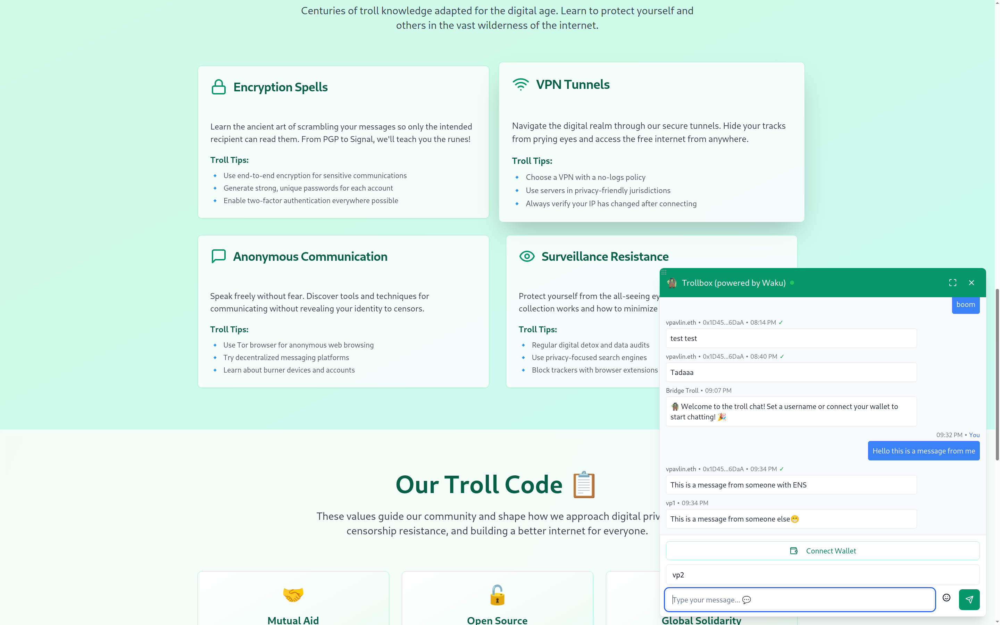

# waku-trollbox

A decentralized chat component built with React, Web3 wallet integration, and Waku messaging protocol.



## Features

- 🧌 Real-time decentralized messaging via Waku protocol
- 🔗 Web3 wallet integration (MetaMask and compatible wallets)
- 🏷️ ENS name resolution for user display names
- ✅ Message signing and verification
- 🎨 Self-contained styling (no external CSS dependencies)
- 🌈 Customizable color themes
- 📱 Responsive design with resizable chat window
- 🔒 Privacy-focused with no central server dependency
- 🔐 End-to-end encryption using domain-derived symmetric keys
- ⚙️ Configurable content topics and encryption keys

## Installation

```bash
npm install waku-trollbox
```

**That's it!** No additional configuration required. The component comes with all necessary styles bundled.

## Requirements

- React 16.8+
- A Web3 wallet (MetaMask recommended)

## Usage

### Basic Usage (Recommended)

```tsx
import { Trollbox } from 'waku-trollbox';

function App() {
  return (
    <div className="App">
      <Trollbox />
    </div>
  );
}
```

### Usage with Custom Colors

```tsx
import { Trollbox } from 'waku-trollbox';

function App() {
  return (
    <div className="App">
      <Trollbox 
        primaryColor="purple"
        accentColor="indigo"
      />
    </div>
  );
}
```

### Advanced Usage with Full Configuration

```tsx
import { Trollbox } from 'waku-trollbox';

function App() {
  return (
    <div className="App">
      <Trollbox 
        appId="my-custom-app"
        encryptionKey="my-secret-key-32-chars-long"
        ephemeral={true}
        primaryColor="indigo"
        accentColor="purple"
      />
    </div>
  );
}
```

## Props

| Prop | Type | Default | Description |
|------|------|---------|-------------|
| `appId` | `string` | `window.location.hostname` | Custom identifier for generating content topic. Allows apps to have isolated chat rooms. |
| `encryptionKey` | `string` | Domain-derived key | Custom 32-character encryption key. If not provided, a key is derived from the domain. |
| `ephemeral` | `boolean` | `false` | Whether messages should be ephemeral (not stored) on the Waku network. When `true`, only live messages are shown. |
| `primaryColor` | `string` | `'emerald'` | Primary color theme for the trollbox UI. Options: `'emerald'`, `'blue'`, `'purple'`, `'red'`, `'indigo'` |
| `accentColor` | `string` | `'blue'` | Accent color for user messages and highlights. Options: `'blue'`, `'green'`, `'purple'`, `'red'`, `'indigo'` |

### Color Customization

The trollbox supports theme customization through `primaryColor` and `accentColor` props:

#### Primary Color
Controls the main UI elements like header, buttons, and main branding:
```tsx
<Trollbox primaryColor="purple" />
```

Available options: `emerald`, `blue`, `purple`, `red`, `indigo`

#### Accent Color
Controls user message bubbles and user-specific highlights:
```tsx
<Trollbox accentColor="green" />
```

Available options: `blue`, `green`, `purple`, `red`, `indigo`

#### Color Combinations
You can mix and match colors for unique themes:
```tsx
// Ocean theme
<Trollbox primaryColor="blue" accentColor="indigo" />

// Forest theme  
<Trollbox primaryColor="emerald" accentColor="green" />

// Royal theme
<Trollbox primaryColor="purple" accentColor="indigo" />
```

### Using Custom Props

#### App ID
Use `appId` to create isolated chat rooms for different applications:

```tsx
<Trollbox appId="my-game-lobby" />
```

Different `appId` values will create completely separate chat channels.

#### Encryption Key
Provide a custom encryption key for enhanced security:

```tsx
<Trollbox encryptionKey="your-32-character-secret-key-here" />
```

**Note**: The encryption key should be exactly 32 characters. If shorter, it will be padded; if longer, it will be truncated.

#### Ephemeral Messages
Enable ephemeral mode to only show live messages without storing them:

```tsx
<Trollbox ephemeral={true} />
```

This is useful for temporary chat sessions or privacy-focused applications.

### Advanced Usage with Provider Control

If you need more control over the toast notifications:

```tsx
import { TrollboxCore, TrollboxProvider } from 'waku-trollbox';

function App() {
  return (
    <div className="App">
      <TrollboxProvider>
        <TrollboxCore 
          appId="my-app"
          ephemeral={true}
          primaryColor="indigo"
          accentColor="purple"
        />
        {/* Your other components */}
      </TrollboxProvider>
    </div>
  );
}
```

## Configuration

### Default Behavior
Without any props, the trollbox automatically generates:
- A unique content topic based on your domain for isolated chat rooms
- A symmetric encryption key derived from your domain for secure messaging
- Persistent message storage on the Waku network
- Emerald primary theme with blue accents

### Custom Configuration
With props, you can:
- Create isolated chat rooms using custom `appId`
- Use shared encryption keys across different domains
- Enable ephemeral messaging for privacy
- Customize colors to match your app's branding

## Security Features

- **Message Encryption**: All messages are encrypted using symmetric keys
- **Message Signing**: Wallet-connected users can sign messages for verification
- **ENS Integration**: Automatic resolution of Ethereum Name Service addresses
- **Isolated Channels**: Each app/domain gets its own isolated chat channel
- **Configurable Privacy**: Choose between persistent and ephemeral messaging

## API

### Components

- `Trollbox` - Complete trollbox with providers and styles (recommended)
- `TrollboxCore` - Core trollbox component without providers
- `TrollboxProvider` - Provider component for toast notifications

### Services

The package exports several services that can be used independently:

```tsx
import { walletService, wakuService, ensService } from 'waku-trollbox';

// Connect wallet
const wallet = await walletService.connectWallet();

// Send a message
await wakuService.sendMessage({
  id: 'unique-id',
  text: 'Hello world!',
  timestamp: Date.now(),
  author: 'username'
});

// Resolve ENS name
const displayName = await ensService.getDisplayName(address, fallbackFormatter);
```

## Troubleshooting

### Styling Issues

If the trollbox appears unstyled:
1. Try manually importing the CSS: `import 'waku-trollbox/dist/trollbox.css'`
2. Check that your bundler supports CSS imports
3. Ensure the package was installed correctly

### Connection Issues

If messages aren't sending:
1. Check browser console for Waku connection errors
2. Ensure you have a stable internet connection
3. Try refreshing the page to reconnect to Waku network

### Different Chat Rooms

If you want separate chat rooms for different parts of your app:
```tsx
// Lobby chat
<Trollbox appId="lobby" primaryColor="emerald" />

// Game chat  
<Trollbox appId="game-room-123" primaryColor="red" />
```

## License

MIT
